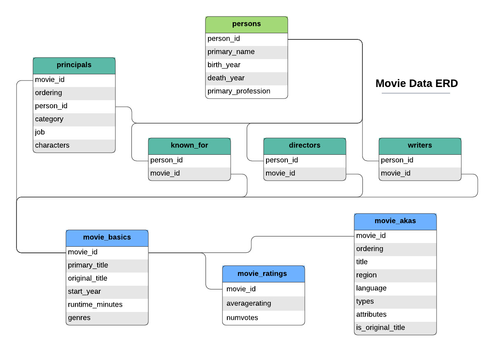
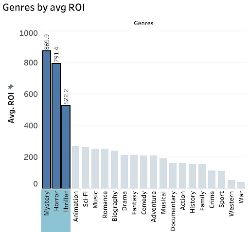
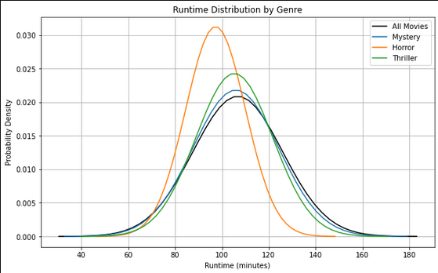
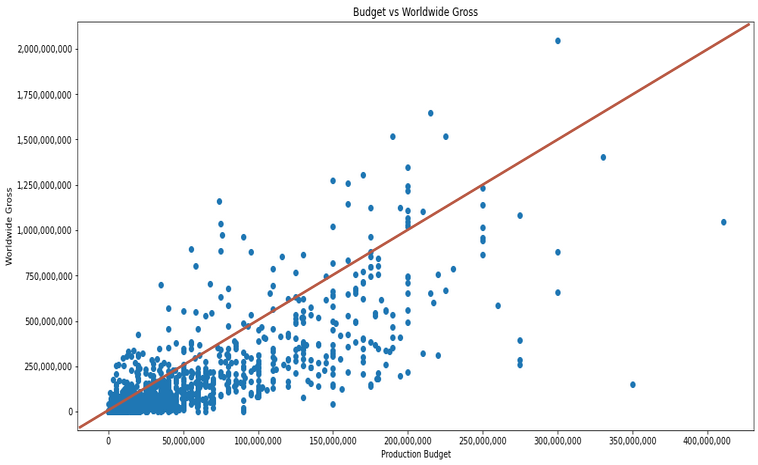

# **No Business Like Show Business** - *Film Strategy for Box Office Success*
## Business Understanding

Our company has decided to create a new movie studio, and we have been tasked with analyzing historical box office success and providing actionable insights to guide content production. Our film strategy recommendations focus on key stakeholder questions such as:

- What defines success for a film- does popularity equate to profitability?
- What type of films have historically seen the greatest ROI?
- Do higher production budgets lead to higher revenues?

## Data Understanding
We were provided raw datasets from various sources, which are described in [Final.ipynb](https://github.com/pyamin1878/Movie-Project/blob/main/Final.ipynb) and can be explored further in the [Data](https://github.com/pyamin1878/Movie-Project/tree/main/Data) directory. 

Of these datasets, [IMDb](https://www.imdb.com/) and [The Numbers](https://www.the-numbers.com/) provided the most insight for our analysis. 

IMDb contained a [SQL](https://docs.python.org/3/library/sqlite3.html) database from which we created a dataframe of movie genres, runtimes, release years, and audience ratings.

The Numbers dataset contained movie production budgets and worldwide gross revenues from which we calculated return on investment (ROI) rates to then merge with the IMDb data.

After combining the datasets, our final analysis was limited to 1490 movies spanning 2010-2019.


## Data Prep & Cleaning


### Data Cleaning
- Two sets of data are extracted from IMDb: `movie_basics` (basic movie information) and `movie_ratings` (ratings and votes).
These datasets are then combined into a single DataFrame (a tabular data structure), focusing on titles, runtime, genres, ratings, and votes.

- This dataset is read and processed to extract budget, gross revenue, and release dates.

- The release dates are converted to a date format, and a new column for the year is created.

- Monetary values (like budget and revenue) are converted from text to numeric values for analysis.

- A new column for 'Return on Investment' (ROI) is created to evaluate the financial performance of the movies.
### Merging the Data
- The cleaned IMDb and The Numbers data are merged based on movie titles and release years to create a comprehensive dataset.
- Unnecessary columns are dropped, and the data is cleared of any missing values.
- The data is sorted based on ROI in descending order.

### Cleaned Data

The cleaned and processed data is saved as CSV files for easy access and use in future analyses. You can access the cleaned `.csv` file here [Clean Data](https://github.com/pyamin1878/Movie-Project/blob/main/Data/movie_clean_v2.csv).

## Analyses + Results/Recommendations 

### Recommendation 1

**Genre**: 

Focus on producing a movie that blends horror, mystery, and thriller genres. This combination has been identified as having the highest Return on Investment, making it a safe bet for the studio's initial projects and satisfying stakeholders.



### Recommendation 2

**Runtime**: 

Runtime recommendation: Aim for a movie runtime of under 2 hours. This length aligns with audience preferences, ensuring broader appeal and impact.



### Recommendation 3

**Budget**: 

Adopt a low-budget strategy, focusing on movies that require minimal investment but yield high ROI. This approach reduces financial risk and fosters creativity in storytelling.



## Conclusions and Next Steps

## Repo Structure 
```
├── Data
├── Images
├── Notebooks
│   ├── 
│   ├── 
├── .gitignore
├── Final.ipynb
├── LICENSE
├── README.md
```
